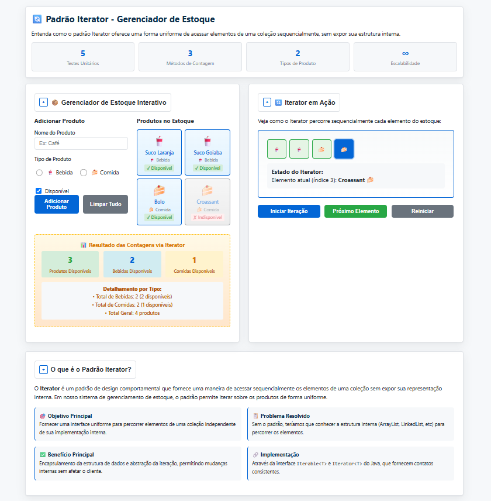
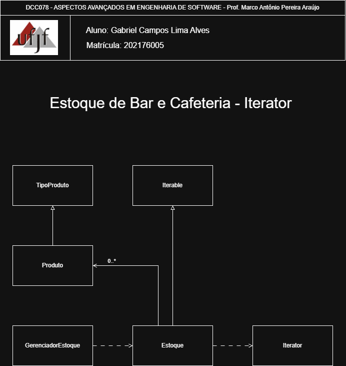

# Iterator — Gerenciador de Estoque de Produtos

<p align="center">
	<a href="https://www.ufjf.br/" rel="noopener">
		
	</a>
</p>

<h3 align="center">DCC078-2025.3-A — Aspectos Avançados em Engenharia de Software (UFJF/ICE)</h3>

---

## 📝 Sumário
- [Sobre](#sobre)
- [Diagrama de Classe](#diagrama)
- [Funcionalidades](#funcionalidades)
- [Tecnologias](#tecnologias)
- [Exemplo de Uso](#exemplo)
- [Como Executar e Testes](#testes)
- [Autor](#autor)

## 🧐 Sobre <a name="sobre"></a>
> **Disciplina:** DCC078 – Aspectos Avançados em Engenharia de Software   </br>
> **Projeto:** Demonstração do padrão Iterator em um sistema de gerenciamento de estoque   </br>
> **Docente:** Prof. Marco Antônio Pereira Araújo  </br>
> **Data de entrega:** 03/12/2025   </br>
> **Aluno:** [Gabriel Campos Lima Alves](#autor)  </br>

### Padrão Iterator
Implementação do padrão **Iterator** aplicada a um sistema de gerenciamento de estoque de produtos. O foco é fornecer uma forma uniforme de acessar elementos de uma coleção sequencialmente, sem expor sua estrutura interna. Demonstra:
- Um iterador padrão (`Iterator`) para percurso sequencial de produtos
- Encapsulamento da estrutura de dados interna
- Abstração da iteração através da interface `Iterable`
- Separação clara entre a coleção e o mecanismo de acesso
- Flexibilidade na implementação de diferentes estruturas de dados

Também há uma interface web de demonstração interativa incluída: [Interface de Demonstração](http://localhost:8000/index.html)
<p align="center">
	
</p>

## 📐 Diagrama de Classe <a name="diagrama"></a>
O diagrama abaixo representa a arquitetura do projeto, enfatizando o padrão **Iterator** como mecanismo de percurso:

<p align="center">
	
</p>

## 🚀 Funcionalidades <a name="funcionalidades"></a>
### Sistema de Gerenciamento de Estoque
- **Produto**: Classe que representa um produto com suas propriedades
- **Estoque**: Coleção que implementa `Iterable<Produto>`
- **GerenciadorEstoque**: Utilitário com métodos para contagem via Iterator

### Características do Produto
- Nome do produto
- Tipo (BEBIDA, COMIDA)
- Disponibilidade em estoque
- Getters e setters para manipulação de dados

### Recursos
- ✅ Implementação completa do padrão Iterator
- ✅ Encapsulamento da estrutura de dados interna (ArrayList)
- ✅ Interface `Iterable<Produto>` para acesso uniforme
- ✅ Métodos de contagem baseados em iteração
  - Contar produtos disponíveis
  - Contar bebidas disponíveis
  - Contar comidas disponíveis
  - Contar total por tipo
- ✅ Código desacoplado e flexível
- ✅ Cobertura completa de testes com JUnit 5
- ✅ Interface web interativa para demonstração

## 🛠️ Tecnologias <a name="tecnologias"></a>
- **Java 11+**
- **JUnit 5** - Framework de testes
- **Maven** - Gerenciamento de dependências
- **HTML5/CSS3/JavaScript** - Interface web de demonstração
- **Git** - Controle de versão

## 📊 Exemplo de Uso <a name="exemplo"></a>
```java
// Criar produtos
Produto cafe = new Produto("Café", true, TipoProduto.BEBIDA);
Produto suco = new Produto("Suco Natural", true, TipoProduto.BEBIDA);
Produto bolo = new Produto("Bolo de Chocolate", false, TipoProduto.COMIDA);

// Criar estoque
Estoque estoque = new Estoque(cafe, suco, bolo);

// Iterar usando forEach (que utiliza Iterator internamente)
for (Produto produto : estoque) {
    System.out.println("Produto: " + produto.getNome());
    System.out.println("Disponível: " + produto.isDisponivel());
}

// Ou usar métodos do GerenciadorEstoque
Integer disponíveis = GerenciadorEstoque.contarProdutosDisponiveis(estoque);
Integer bebidas = GerenciadorEstoque.contarBebidasDisponiveis(estoque);
Integer comidas = GerenciadorEstoque.contarComidasDisponiveis(estoque);
```

**Saída esperada:**
```
Produto: Café
Disponível: true

Produto: Suco Natural
Disponível: true

Produto: Bolo de Chocolate
Disponível: false

Total de produtos disponíveis: 2
Total de bebidas disponíveis: 2
Total de comidas disponíveis: 0
```

## 🧪 Como Executar e Testes <a name="testes"></a>
### Pré-requisitos
- Java 11 ou superior
- Maven 3.6+
- Python 3 (para servidor web local - opcional)

### Comandos
```bash
# Compilar o projeto
mvn clean compile

# Executar todos os testes
mvn test

# Executar teste específico (exemplo)
mvn test -Dtest=padroescomportamentais.iterator.EstoqueTest

# Empacotar
mvn package

# Executar servidor web para interface (em outro terminal)
python3 -m http.server 8000
```

### Testes Inclusos
- **EstoqueTest**: Testes unitários cobrindo:
  - Contagem de produtos disponíveis
  - Contagem de bebidas disponíveis
  - Contagem de comidas disponíveis
  - Contagem total por tipo
  - Iteração completa do estoque
  - Validação do padrão Iterator

Total: 5 testes unitários com cobertura completa do padrão Iterator

## 👨‍💻 Autor <a name="autor"></a>
**Gabriel Campos Lima Alves**
Matrícula: 202176005
Email: campos.gabriel@estudante.ufjf.br
GitHub: [@CamposCodes](https://github.com/CamposCodes)

---

*Projeto de uso acadêmico exclusivo para a disciplina DCC078 - UFJF*
